# lab2web

**Nama      : Naufal Nirwansyah** 
**Kelas     : TI.20.A1** 
**NIM       : 312010174** 
**Matkul    : Pemrograman Web**
  

# Langkah-Langkah Praktikum 2

Membuka aplikasi editor, disini saya menggunakan Visual Code Studio

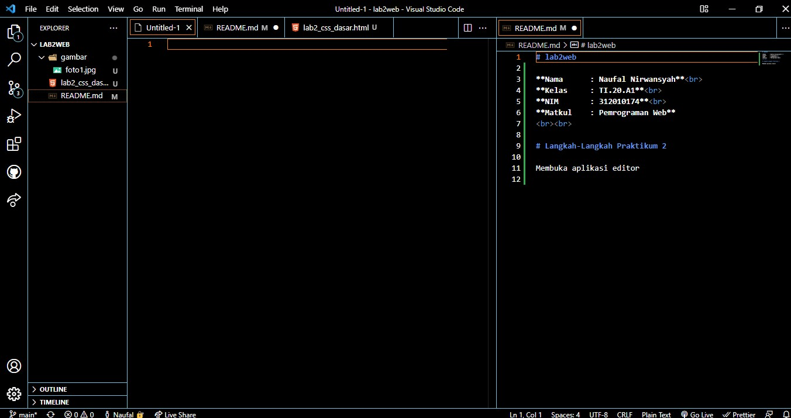
   
Kemudian membuat file HTML 

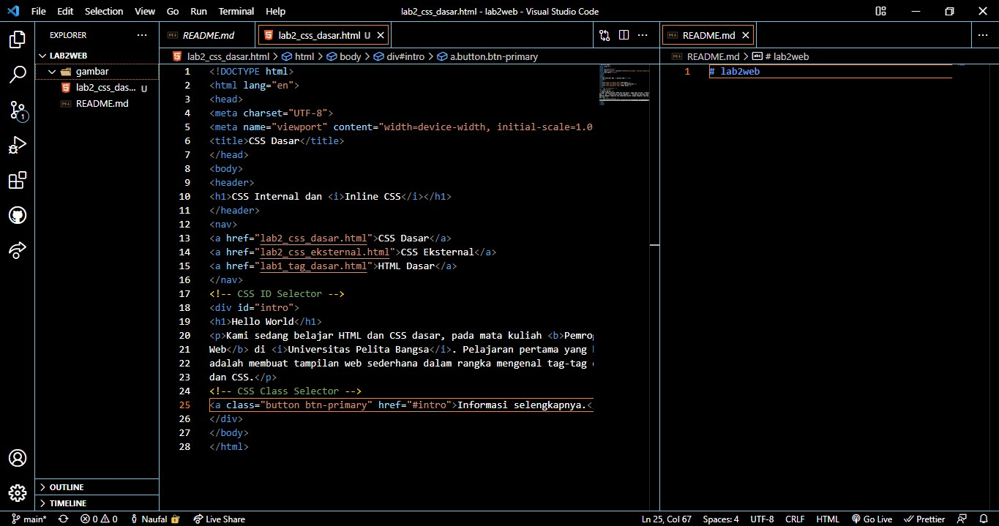
   
Dari dokumen tersebut jika di run melalui browser (disini saya menggunakan Micorosft Edge) akan menampilkan input seperti berikut :

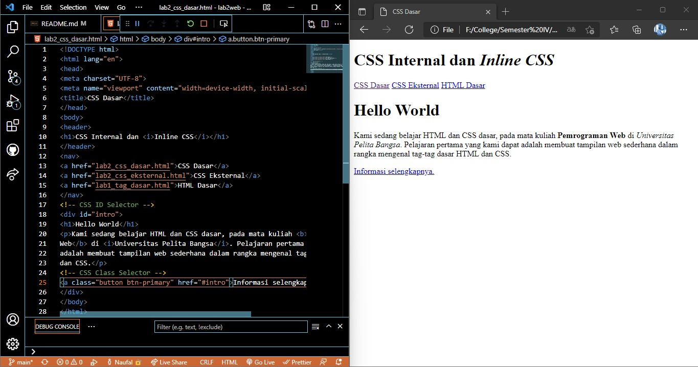
   

## Mendeklariskan CSS Internal

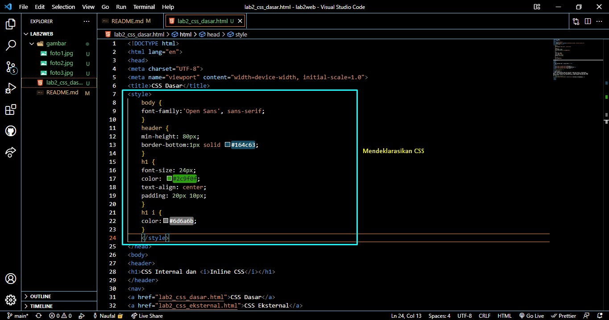
  

Kemudian kita simpan html yang telah ditambahkan CSS, lalu kita refresh browser maka akan menampilkan perubahan seperti berikut :
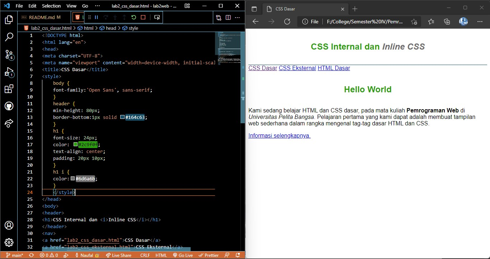
   

## Menambahkan Inline CSS
Tambahkan deklarasi Inline CSS pada tag `
` seperti berikut :
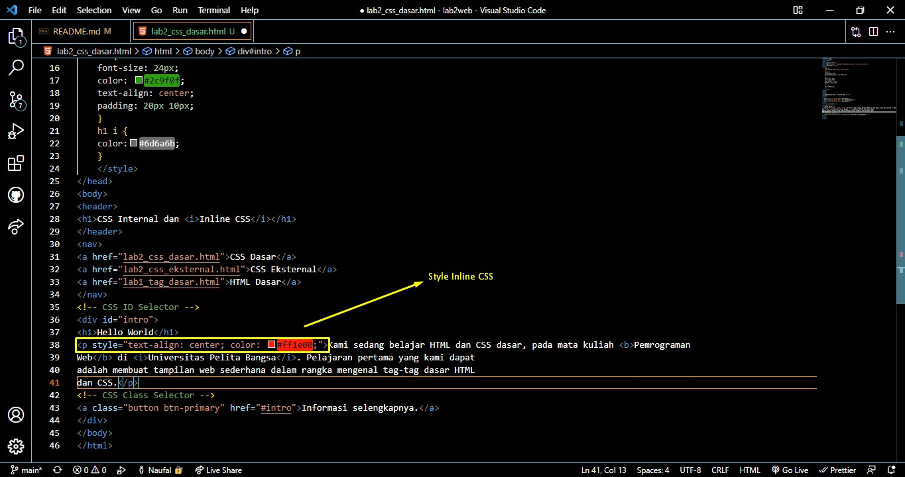
  

Jika kita refresh, maka dari style <b>Inline CSS</b> yang tadi akan menampilkan perubahan seperti berikut :
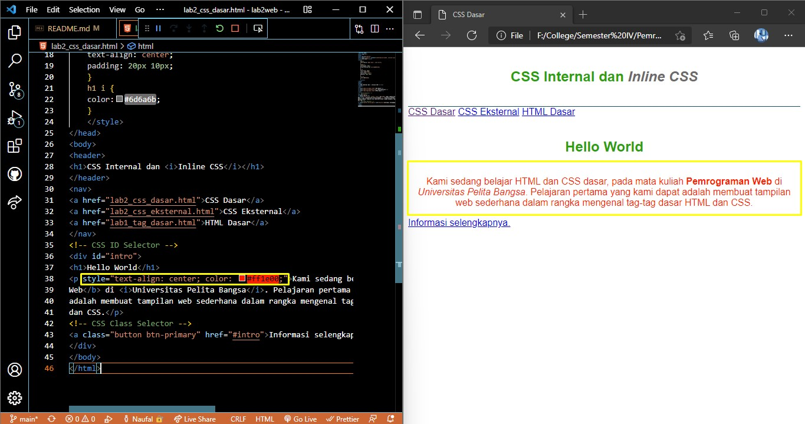
  

## Membuat CSS External
Buatlah file baru dengan nama <b>style_eksternal.css</b> kemudian buatlah deklarasi CSS seperti berikut.
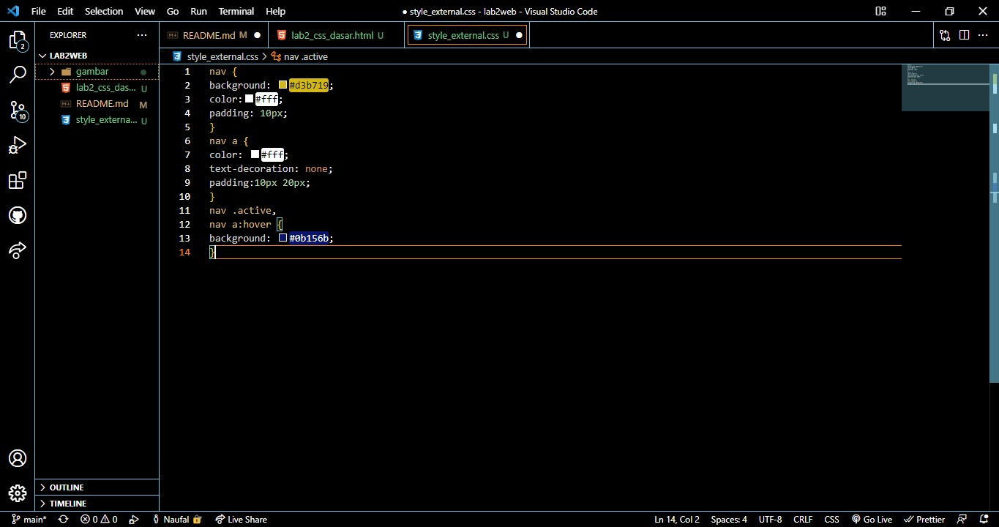
  

Kemudian tambahkan tag `<link>` untuk merujuk file css yang sudah dibuat pada bagian `<head>`
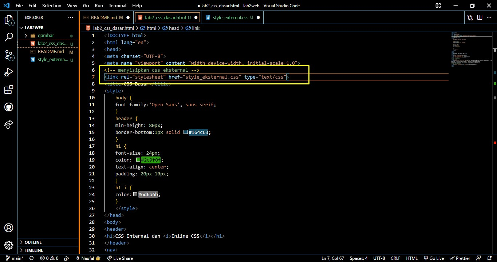
  

Setelah kita input style yang tadi, kemudian kita save dan refresh browser nya. Maka akan menampilkan seperti berikut :
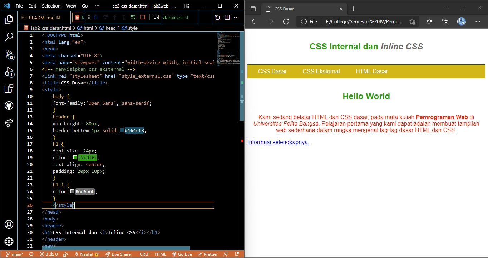
  

## Menambahkan CSS Selector
Selanjutnya menambahkan CSS Selector menggunakan `ID dan Class Selector`. Pada file
`style_eksternal.css` , tambahkan kode berikut :    
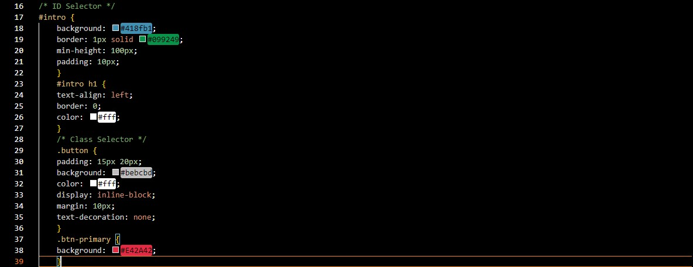
  

Kemudian simpan dan refresh kembali browser nya, dari kode diatas akan menampilkan hasil seperti berikut :  
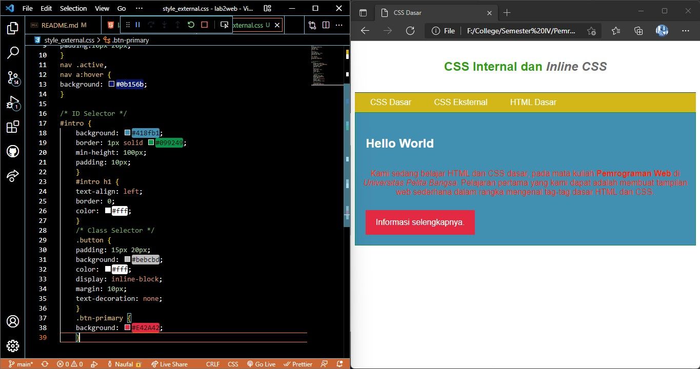